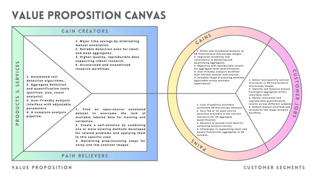
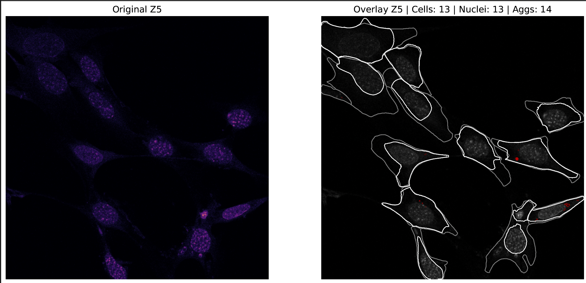
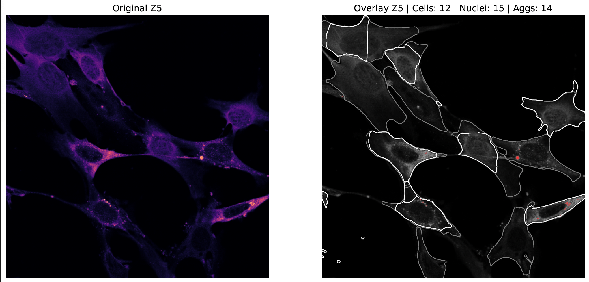

# LOGBOOK

# First Results

https://drive.google.com/drive/folders/1AnUnfZbJpZWdKvpxJOniLWIzyFzvSiDI?usp=drive_link

# Some shotcuts
```conda activate napari-env```
```ctrl+K V```


# Paper structure must follow
• Introductie
 - Context, Probleem, Bestaand werk, Gat, Voorstel
• Achtergrond
- Basiskennis (literatuur)
- State of the art (literatuur)
- Stakeholder-analyse
• Requirements
- Product (inclusief gebruikersinterface)
- Model
• Prototype
- Idee generatie en value proposition
- Flow diagrams en AI breakdown
- Gebruikersonderzoek (empathy map bijvoorbeeld)
- (Paper) Prototype
• Model
- Methodologie (dataset, architecture, ...)
- Resultaten (performance en andere kwaliteitsmaten)
- Conclusie
• Discussie
- Implicaties, Future work, Aanbevelingen
- Terugkomen op requirements
• Bronnenlijst (overweeg het gebruik van een referentiemanager
1 https://www.ieee.org/conferences/publishing/templates.html
2 https://www.acm.org/publications/authors/submissions


# Installing Cellpose
in order to download the cellpose envoriement I follow this instructures [cellpose link](https://cellpose.readthedocs.io/en/latest/index.html) 

```python -m cellpose``` 

# Communication with Carolina
---
I asked some question to Carolina via mail:

```text
Tue 22 Apr, 12:25 
to c.konrdorferrangel-2, j.b.antonissen, b.m.l.baselmans

Title: Image Processing-Based Quantification of Neural Aggregates for Huntington’s Disease Detection
Main Research Question:
How can image processing methods be implemented to quantify neural aggregates in microscopy images for Huntington’s disease detection?
Sub-Questions:
1. What preprocessing steps are necessary to enhance image quality for accurate aggregate detection?
2. How can cells be effectively detected in microscopy data before quantifying neural aggregates within them? 

I am planning to work based on this title and these research questions. Does it look appropriate to you? 
I’m working with .lif files. Which channel or channels (e.g., HA?) should I focus on for the best results?
Below is the workflow I’ve created:

Load the .lif file
Select the relevant channel
Merge the Z-slices (3D to 2D)
Detect cell boundaries
Find aggregates within those boundaries
However, cell detection is currently not working well. I will focus on it.  Why do you emphasize 3D? What are the advantages and disadvantages of working with 3D images versus 2D projections (like stacked 8 Z-slices)?
Until now, I’ve been collapsing the 3D data into a 2D image for easier processing. Do you think this is a valid method, or are there better alternatives for working with 3D data directly?
In the attached PDF file, I worked with a .lif image and tried to identify protein aggregates. You can ignore the code sections — the photos are the most important part.  Do you think the last image reflects the main goal of the project?
```

# 23.04.2025 
## Todo list

1. Read expert workshop slides 
2. Complete Introduction 
3. Compelete Background 
4. Mension about paper which you have read and reseach which you have done with lamia and self in the logbook, so hier.

### Proggess
* Introduction and background part has been wrote. It looks like compleete. I have got a mail from carolina about the answer of my question and it is more clear now. The project must be 3d image progessing. And the name of the paper and main question eddited. 

* The order of the Z-Stacks is not true in the python. I have been bussy wiht this error for 4 days i coudnt solve it yet. 


# 24.04.2025
1. **Requiremernts:** Look at the lessons notes and create and requirements.
2. **Prototype:** Look at the lessons notes. And bring something to requirements.
3. 

### Requirements Table

| ID  | Domain        | Type           | Requirement Statement                                                                 | Justification                                                                 | MoSCoW |
|-----|---------------|----------------|----------------------------------------------------------------------------------------|--------------------------------------------------------------------------------|--------|
| R1  | Image Analysis | Functional     | The system **must** detect all individual cells in the microscopy images.              | Accurate cell detection is essential to locate and quantify neural aggregates. | Must   |
| R2  | Image Analysis | Functional     | The system **must** process the HA and CCT1 channel  of the microscopy data.                | HA channel  specifically marks the Huntington-related aggregates. CCT1 channel is usefull to see cell body.         | Must   |
| R3  | Preprocessing  | Functional     | The system **should** apply noise reduction before segmentation.                       | Reducing noise helps prevent false detections in cell boundaries.              | Should |
| R4  | Aggregates     | Functional     | The system **must** quantify aggregates larger than a defined intensity threshold.     | Only aggregates above the threshold are considered relevant. | Must   |
| R5  | Output         | Non-functional | The output **should** include a CSV file with cell positions, aggregate count, and size.| Allows easy further analysis and validation by domain experts.                | Should |
| R6  | I/O Format     | Functional     | The system **must** accept only `.lif` files as input for 3D microscopy analysis.      | Ensures compatibility with standardized imaging data used in this project.     | Must   |
| R7  | Output         | Functional     | The system **must** generate a structured file (CSV or JSON) with aggregate count, location, and their association with detected cells. | Provides interpretable results for downstream analysis and biological insight. | Must   |
| R8  | Output         | -----          | The system **could** generate annotated image projections for visual inspection.       | Helps researchers visually verify the detection quality and segmentation.       | Could  |
| R9  | System	Compatibility         | ---          | The system should be compatible with Windows, macOS, and Linux for broader accessibility.       | Makes the tool available to a wider user base.       | Should  |


Vragen naar Caroline
* What is your current metodololy for quantification of aggregate? like
    1. Get .lif file (3D fluorescence microscopy data)
    2. Open Fiji
    3. Open AggreCount
    4. AggreCount picks the most intensieve z-stacks
    5. AggreCount finds aggregates
    4. get results for CSV file (2d)

* Wat is your current metodology?


# 28.04.2025
## Todo List
1. Write about Wyh 3d is important. 
2. (prototype) Idea generation and value proposition
3. Flow diagrams
4. AI breakdown
4. User research (e.g. empathy map)
5. (Paper) Prototype
6. which design pattern will you use and wyh (look at the google and choose one of them)

o Design, Development and Results of a prototype
• Design and development are part of the methods
• The prototype itself is a result
• For your paper, don't include theories you can't defend with source
o HvA Master Applied AI Design Class is not a source


## Value Proposition V1
### Customer Jobs
1. Detect and quantify cellular structures in fluorescence microscopy images.
2. Identify and measure aggregates within individual cells.
3. Obtain consistent and reproducible results across different samples.
4. Minimize manual workload and reduce analysis time.

### Pains
1. Lack of publicly available annotated datasets for microscopy images.
2. Very few or no open-source solutions available in the current literature.
3. Absence of ground truth datasets to validate analysis methods.
4. Challenges in segmenting small, dim aggregates.


### Gains
1. Faster and automated microscopy data analysis.
2. Improved accuracy and reliability in detecting and quantifying structures.
3. Objective, quantitative results that support research conclusions.
4. Easy-to-use workflows with minimal manual input.
5. More scalable and reproducible research processes.

### Value Map
### Products & Services
1. Automated cell detection algorithms.
2. Aggregate detection and quantification tools (position, size, count analysis).
3. User-friendly analysis interface with adjustable parameters.
4. A complete analysis pipeline.

### Pain Relievers
1. Find an open-source annotated dataset to overcome the lack of available labeled data for training and validation.
2. Create a self-solution by combining one or more existing methods developed for related problems and applying them to this specific case 
3. Optimizing preprocessing steps for noisy and low-contrast images.

### Gain Creators
1. Major time savings by eliminating manual annotation.
2. Reliable detection even for small and weak aggregates.
3. Higher-quality, reproducible data supporting robust research.
4. Accelerated and streamlined research workflows.


# 29.04.2025

## 🔬 Value Proposition V2 (Last)

### 🎯 Customer Jobs
1. Detect and quantify cellular structures in 3D fluorescence microscopy images.  
2. Identify and measure mutant huntingtin aggregates within individual cells.  
3. Obtain consistent and reproducible quantification results across different samples.  
4. Reduce manual workload and streamline the image analysis workflow.

### 😟 Pains
1. Lack of publicly available annotated 3D microscopy datasets.  
2. Very few or no open-source solutions available in the current literature for 3D aggregate quantification.
3. Absence of ground truth data for validating analysis results.  
4. Challenges in segmenting small and weakly fluorescent aggregates in 3D volumes.

### ✨ Gains
1. Faster and automated analysis of 3D fluorescence microscopy images.  
2. Improved reliability and consistency in detecting and quantifying aggregates.  
3. Objective and reproducible results for aggregate-level quantification.  
4. User-friendly analysis workflow with minimal manual intervention.  
5. Scalable image processing methods applicable across multiple experiments.

---

## 🛠 Value Map

### 🧪 Products & Services
1. Automated cell and aggregate detection tools for 3D microscopy images.  
2. Aggregate quantification modules (location, size, count).  
3. A modular, user-friendly analysis pipeline implemented in Python.  
4. Adjustable parameters for flexible preprocessing and analysis control.

### 🔧 Pain Relievers
1. Find an open-source annotated dataset to overcome the lack of available labeled data for training and validation. 
2. Combine multiple existing algorithms into a tailored workflow specifically optimized for 3D fluorescence image analysis. 
3. Robust preprocessing pipeline tailored for noisy and complex 3D image data.

### 🚀 Gain Creators
1. Significant time savings by reducing manual annotation and segmentation.  
2. Robust detection performance, even for small and low-contrast aggregates.  
3. Higher data quality and reproducibility for downstream research.  
4. Streamlined workflows that accelerate scientific insight from microscopy images.

### Value Proposition Canvas v0


### Value Proposition Canvas v1 (Last)


-------
## Current Flow
1. Open Fiji
2. Load the .lif file (2D MAXprojection fluorescence microscopy data)
3. Use AggreCount
4. AggreCount detects aggregates
5. Export 2D results to a CSV file


## Happy Flow

### 1. Load `.tif` File
- Import full multichannel 3D fluorescence microscopy data  
- Supported via libraries like `bioformats` or `aicsimageio`

### 2. Display File Metadata and Channel Previews
- Show image info: number of channels, dimensions, number of Z-slices  
- Display intensity-based preview for each channel (e.g., max-projection or middle slice)  
- Highlight the most intense Z-slice per channel for easy recognition

### 3. User Selects Relevant Channel(s)
- User selects which channel(s) to analyze (e.g., C2 = aggregates, C0 = nuclei)

### 4. Preprocess Image Stack
- Apply 3D denoising and contrast normalization  
- Preserve all Z-slices — no projection used

### 5. Cell Segmentation
- Use nuclear channel to detect and segment cell regions  
- Enables per-cell aggregate quantification

### 6. 3D Aggregate Detection
- Detect aggregates in selected channel(s) across the full Z-stack  
- Use 3D thresholding, connected components, or ML-based segmentation

### 7. Quantification
- For each aggregate, extract:
  - Volume  
  - Position (x, y, z)  
  - Intensity metrics  
- (Optional) Link aggregates to cells for per-cell stats

### 8. Export Results
- Output quantification results in CSV or JSON  
- Include image metadata and selected channels for traceability

### 9. (Optional) Visualization
- Provide 3D visualizations or annotated Z-stack overlays for result validation


## Solution of the z-slice problem:
When you are try to anysis the foto of the cell
Python has a problem, when it works with the .lif file. it can open it but it struggle to show correct order of the z-slices, it shows just rondom slices. Now i have a solition. it is just convert file to .tiff file. 


# 12.05.2025
## Todo List
1. Flow diagrams (current + happy)
2. AI breakdown
3. User research (e.g. empathy map) ?? not hard just 10 min
4. Level of Automation ??
5. Which design pattern will you use and wyh (look at the google and choose one of them)
6. Which model have been used (cellpose has been used en last version.) Nuclei and cellbody  detection currrent pc and de process time)
5. De library and the technologies which is used (napari(for 3d visualizations), skime, cellpose(cellbody, nuclei quantification))

## Paper Prototype Base


## Paper Prototype First feedback


<!--   -->

## Current Flow Diagram


## Happy Flow Diagram Base


## Happy Flow Diagram V1
Feedback loop added.


# 13.05.25
## To Do list 
1. Which design pattern will you use and wyh (look at the google and choose one of them)
2. Which model have been used (cellpose has been used en last version.) Nuclei and cellbody  detection currrent pc and de process time)
3. De library and the technologies which is used (napari(for 3d visualizations), skime, cellpose(cellbody, nuclei quantification))
4. User research (e.g. empathy map) ?? not hard just 10 min
5. Level of Automation ??
6. AI breakdown


## Google Design pattern
**Adapt AI with user feedback**
Adapt your AI system with feedback from people, during individual interactions and over time.
Human-AI interactions are a bidirectional feedback loop. AI learns from users to personalize their experiences, and users adapt their behaviors and workflows in response to AI outcomes. Set up feedback mechanisms that can be used to interpret AI outcomes, and account for changes introduced by AI.

---

Cellpose has a adjustable parameter for example diameter or (other two parameter) i can show to user that and explanation with it and i can say if you are not happy the result change the parameter and try one more time. it can be. for example if the model detect the cellkern too big just work with smaal diamaeter but keep in mind it cost time. 

---

## Adaptive AI Through Feedback

Our system design closely follows Google's *Adapt AI with user feedback* design pattern, which emphasizes the importance of creating bidirectional feedback loops between users and AI systems. This pattern encourages dynamic adjustment based on user interaction and evolving expectations.

In our application, segmentation is first performed automatically using default Cellpose-SAM parameters. Immediately after, the user is presented with the result and prompted with:
**"Didn’t get the result you expected?
You can go back, adjust the settings, and try again for a better result."**


This simple prompt initiates a lightweight feedback loop. Users are empowered to modify the `diameter` parameter, which controls the expected object size, and observe how the output changes. Although this form of feedback is implicit—users are not explicitly rating or scoring the results—it directly shapes the behavior of the system and adapts it to the user’s context and goals.

To support a wide range of user expertise, we include a collapsible “Expert Settings” panel, where advanced parameters such as `flow_threshold` and `cellprob_threshold` can be adjusted. This structure aligns with Google's recommendation to support both short-term interaction-level adaptation and long-term personalization, without compromising usability.

By encouraging iterative interaction and adaptation through meaningful user control, our system operationalizes the *Adapt AI with user feedback* principle in a practical and user-friendly way.


SO update de paper prototype:
1. Add feddback icon last page
2. Add parameter settings 2. page


### Technologies Used: Cellpose-SAM and Threshold-Based Aggregate Detection
In this study, we utilized a combination of advanced segmentation and image processing techniques tailored for fluorescence microscopy of neural aggregates. The key components of our pipeline are as follows:

### Cellpose-SAM for Cell Segmentation
For segmenting both the cell bodies and nuclei, we used the latest Cellpose-SAM model. This model is a fusion of the original Cellpose deep learning-based segmentation framework with the Segment Anything Model (SAM) developed by Meta AI. SAM is a transformer-based model that can segment objects in images without requiring class-specific supervision. When combined with Cellpose, it becomes highly effective for biomedical data, where object shapes vary significantly and boundaries may be unclear.

Cell Bodies were segmented from Channel 4 (C4) using Cellpose-SAM with an estimated diameter of 100 pixels.

Cell Nuclei were segmented from Channel 1 (C1) with a diameter of 30 pixels.

Each Z-slice of the 3D microscopy stack was processed independently, and Cellpose-SAM produced a binary mask for each frame. These masks were then reconstructed into a full 3D volume, enabling spatial analysis of cell structures. The use of SAM particularly improved segmentation accuracy in low-contrast and noisy regions.

### Aggregate Detection via Thresholding
Following the segmentation of cells, aggregate regions were identified using intensity-based thresholding on the relevant channels (e.g., Channel 2 for Huntington-related aggregates).

Each Z-slice was processed individually.

Various thresholding methods were explored (e.g., Otsu, adaptive, fixed percentile), but we selected a global fixed threshold, manually tuned to highlight only the bright, dense aggregate regions while minimizing background noise.

Morphological operations (e.g., opening, closing) were applied to refine the binary masks.

The resulting masks were assembled across Z-slices to reconstruct 3D aggregate volumes.

### Application to Our Dataset
The described techniques were applied to multichannel .tif microscopy images obtained from neuronal cultures.

Cell body segmentation was performed on Channel 4, using a diameter of 100, processed slice-by-slice using Cellpose-SAM.

Cell nucleus segmentation was carried out on Channel 1, with diameter set to 30.

Each slice of the stack was independently processed to detect masks, which were then assembled into 3D representations using standard volumetric reconstruction techniques. This enabled both per-slice 2D analysis and full 3D visualization.

Aggregate detection was performed on Channel 2, representing Huntington aggregates. A fixed global threshold was chosen after testing different methods, and 3D aggregate volumes were reconstructed.

The pipeline allows inspection of each Z-slice individually (e.g., which aggregates lie inside or outside of cell boundaries), while also offering full 3D visualization of cell bodies, nuclei, and aggregates using tools like Napari, enabling intuitive interaction and validation.


## Libraries and Tools

The following libraries and tools were used to facilitate the segmentation, analysis, and visualization:

Cellpose: The core library for segmentation, enabling the extraction of cell boundaries and the identification of structures like nuclei.

SAM (Segment Anything Model): Leveraged for its ability to segment objects in the images, especially when class-specific labels were not available.

Napari: A 3D image viewer built on top of Qt and PyQt, used for interactive visualization of the 3D models generated from the segmented cell bodies, nuclei, and aggregates. Napari provides an intuitive interface for zooming, rotating, and interacting with multi-dimensional data, and was key for analyzing results in 3D.

NumPy & SciPy: Fundamental libraries for handling and processing large-scale image data (such as creating arrays from Z-slice stacks and performing image processing operations).

Matplotlib: Used for visualizing 2D slice results and generating various plots to analyze the distribution of cell body and aggregate features across the dataset.

scikit-image: A library for general image processing, including thresholding, morphological operations, and filtering.

The combination of these libraries provides a comprehensive and efficient pipeline for processing and analyzing microscopy data.

## Mental exercises and trials for a solution:

### cellpose 3d
It was considered and tested to detect both cells and nuclei using Cellpose 3D. However, it was experienced that the method did not work on a MacBook M1 (2020), likely due to the high GPU requirements. As a result, a Colab Pro account was used to run the process with a high-performance GPU. Even in this setup, cell and nucleus detection took more than an hour, totaling up to three hours for full processing. Given the lengthy processing time and the dependency on high-end GPUs, it was concluded that this method would not be feasible for the current workflow and impractical to run in different environments. Therefore, this approach was abandoned.

### Threshold Methods for Aggregate Detection
In the aggregate detection step, various thresholding techniques were explored to identify potential aggregate regions based on intensity differences in the microscopy images. Several well-established methods from the literature were tested, including:

- **Otsu Thresholding**  
- **Triangle Method**  
- **Mean Thresholding**  
- **Minimum Thresholding**

Although these methods are commonly used in biomedical image analysis, they did not perform consistently well on our dataset. The heterogeneity in image brightness, contrast, and aggregate density across different samples limited the effectiveness of these thresholding strategies.

As a result, a **general thresholding approach** was adopted. In this method, a global thresholding algorithm is applied, but the threshold value itself is user-adjustable. This parameter can be fine-tuned via the user interface (UI) for each image, allowing for better adaptability to the varying conditions present in individual samples.

This solution provides a flexible balance between automation and manual control, helping to accommodate sample variability while maintaining usability.


# 14.05.25
## TODO List
1. User research (e.g. empathy map) ?? not hard just 10 min
2. AI breakdown Level of Automation ??
3. Update the paper prototype (Add feddback icon last page, Add parameter settings 2. page)
4. focuss on iterations and requariments
5. Run it on 10 images with same color.

## Feedback from Bart
- Run it on 10 images not just one image it is bias. 
- All aggregates must be same color but different intencity with mening.


# 19.05.25
## TODO List
1. Update the paper prototype (Add feddback icon last page, Add parameter settings 2. page)
2. Focuss on iterations and requariments
3. Run it on 10 images with same color.

## feedback paper prototype
1. Show the fotos of the input to user. to choose it.  

## Feedback from Lamia:
- [x] In the Introduction → mention Fiji and the imaris program in the Current section.  
- [x] Remove the sub-question “preprocessing” part, keep only the steps. 
    - [x] Answer this sub-question in the Methodology introduction.  
- [x] Evaluation part — only one person bias, discuss this.  
- [x] Explain what aggregate quantification means in Methodology — location, volume, count.  
- [x] Performance metrics — human evaluation by expert as GOLD STANDARD. Why? There’s no other option.  
- [x] Discussion on 3D aggregation is too specific:  
  - [x] Dataset  
  - [x] Methods — aggregate threshold part  
- [x] AI automation level explained.  
- [x] Remove “Idea proportion” texts, keep just a brief summary.  
- [x] Ask Carolina about ethical concerns.  
- [x] Iteration — clarify that it’s a single iteration (before B4).  
  - [x] Mention timing details.  
- [x] Stakeholder analysis from NOAH Leroy — make it clearer. Focus on biomedical researchers, CureQ Health Lab, all parts.  
  - [x] Delete everything below this, last sentence is important.  
- [x] Current flow included.


All of the feedback which is given from Lamia is done.


# 21.05.25
## TODO List
1. ~~Iteration in the model section~~
2. ~~Requirements (model + product {+UI})~~
3. ~~State of the art~~
4. Teruggekomen op requirements in de discussie
5. Redesign de model PART ?? Or ask it  to Lamia
6. Conclusie
7. Update the Paper Prototype 
    - Add feddback icon last page, 
    - Add parameter settings 2. page
    - Show the fotos of the input to user to choose it.  (Le Roy)
9. Run it on 10 images with same color. (Bart)


# 22.05.2025
1. ~~Redesign de model PART ?? Or ask it  to Lamia~~
2. Conclusie
3. Update the Paper Prototype 
    - Add feddback icon last page, 
    - Add parameter settings 2. page
    - Show the fotos of the input to user to choose it.  (Le Roy)
4. Run it on 10 images with same color(!). (Bart)

## 2'nd Feedback from Lamia
1. [x] ~~Write more about ethics.~~
2. [x] ~~Restructure the model.~~
3. [x] Use consistent terms: label, annotation, unlabeled etc.
  - [x] First Explain why annotation is important.
- [x] Discussion
  - [x] Highlight what you did well. Say what you achieved.
    - [x] impackt of socacity
  - [x] Mention what is missing. List weaknesses; why? 
    - [x] dataset
    - [x] pretrained model
    - [x] importance of annotation
  - [x] possible improvements.
    - [x] future work
- [ ] Resubmit the assignment form.

# 26.05.2025
1. ~~Download 20 fotos and convert it to .tif file~~
2. Look at the mail of Carolina


## New UI desicions 
Theese two parameter will be adjustable: But this combination will be default value. it looks more coreect than other values for input images. 
```
threshold = 0.55 * np.max(slice_img)
clean_mask = morphology.remove_small_objects(bright_spots, min_size=9) # Bu parametrede degistirilebilir olsun.
```
  - threshold: 55  (0-100)
  - min_size: 9 (0-20)


# 27.05.2025
1. Look at the mail of Carolina
  - Is it also possible to include the intensity (for each channel) within each volume? That would be amazing
  - Add annotations as… location within the cell (for example, if signal of aggregate colocalizes with signal of nucleus, nuclear localization)
  - In aggrecount there are some criteria that you could use as a base for cellular localization, as for example, the perinuclear region, ect
  - Including annotation regarding the shape of the aggregates (circular, elongated, etc)
  - In the attachment I also included a figure in which there are some regions in the cells annotated as aggregate… but that is not an aggregate I believe, although the signal is very strong. I indicated with the white circles. This happens  because some cells express more mHTT than others and it is hard to “normalize” the signal to all cells. ~~Is there a way to train the algorithm to not recognize this regions as aggregates?~~

## Evaluation of Cellpose on Additional Images
Cellpose has started to be tested on other images as well. It was observed that the detection of nuclei was not very accurate on these additional images. Moreover, in the new images, the number of cells in the CCT1 channel was not equal to the number of cells in the aggregate channel. It was also noted that the CCT1 channel used for detecting cell bodies contained more complex and a greater number of cells compared to the aggregate channel. Based on these observations, it was considered that performing both nuclei and cell body detection on the aggregate channel might be more effective. This way, only the nuclei and cell bodies associated with the aggregates would be detected. However, the results showed that Cellpose still did not perform well in detecting nuclei.

### Channel 0

### Channel 2



# 28.05.2025
1. Look at the mail of Carolina
  - ~~Is it also possible to include the intensity (for each channel) within each volume? That would be amazing~~
  - ~~Add annotations as… location within the cell (for example, if signal of aggregate colocalizes with signal of nucleus, nuclear localization)~~
  - ~~In aggrecount there are some criteria that you could use as a base for cellular localization, as for example, the perinuclear region, ect~~
  - ~~Including annotation regarding the shape of the aggregates (circular, elongated, etc)~~
  - ~~In the attachment I also included a figure in which there are some regions in the cells annotated as aggregate… but that is not an aggregate I believe, although the signal is very strong. I indicated with the white circles. This happens  because some cells express more mHTT than others and it is hard to “normalize” the signal to all cells.~Is there a way to train the algorithm to not recognize this regions as aggregates?~~

??
The dataset contains 20 images with 10 z-slices and 3 channels (cell, nuclei, aggregate), resulting in a total of 600 individual images.
How can an expert evaluate these images, and what quality metrics are typically used in such assessments?


# 🧪 Expert Segmentation Evaluation Form

This form is used to evaluate the quality of segmentation for **Cells**, **Nuclei**, and **Aggregates** in microscopy images. Each image is reviewed individually by an expert.

## ✅ Evaluation Criteria

- **Approved (Y/N):** Is the segmentation acceptable for this class?
- **Score (1–5):** Subjective quality score (1 = Poor, 5 = Excellent)
- **Comments:** Any notable issues (e.g. missing segments, misalignment, oversegmentation)

---

## 📋 Evaluation Table (Sample of N = 5x10 images )

| No | Image ID | Z-slice | Cell Approved (Y/N) | Cell Score (1–5) | Cell Errors                | Nuclei Approved (Y/N) | Nuclei Score (1–5) | Nuclei Errors             | Aggregate Approved (Y/N) | Aggregate Score (1–5) | Aggregate Errors           | Comments               |
|----|----------|---------|----------------------|-------------------|----------------------------|------------------------|---------------------|---------------------------|----------------------------|-------------------------|---------------------------|------------------------|
| 1  | IMG_001  | 1       | Y                    | 4                 | Missing segments           | N                      | 2                   | Misaligned masks          | Y                          | 5                       | None                      | Slice 1 good for cell  |
| 2  | IMG_001  | 2       | Y                    | 5                 | None                      | Y                      | 4                   | None                      | Y                          | 4                       | Oversegmentation          | Slight blur on nuclei  |
| 3  | IMG_001  | 3       | N                    | 2                 | Misaligned masks           | Y                      | 5                   | Blurred                   | N                          | 1                       | Missing segments          | Poor quality slice     |
| …  | …        | …       | …                    | …                 | …                          | …                      | …                   | …                         | …                          | …                       | …                         | …                      |
| 10 | IMG_020  | 10      | Y                    | 4                 | None                      | Y                      | 5                   | None                      | Y                          | 5                       | None                      | All good               |


## 📊 Expert Segmentation Evaluation Metrics

### Approval Rate (per class)

- **Cell:**

$$
\text{Approval Rate}_{\text{cell}} = \frac{\text{Number of "Yes" for Cell Approved}}{\text{Total Number of Images}}
$$

- **Nuclei:**

$$
\text{Approval Rate}_{\text{nuclei}} = \frac{\text{Number of "Yes" for Nuclei Approved}}{\text{Total Number of Images}}
$$

- **Aggregate:**

$$
\text{Approval Rate}_{\text{aggregate}} = \frac{\text{Number of "Yes" for Aggregate Approved}}{\text{Total Number of Images}}
$$

---

### Mean Quality Score (per class)

- **Cell:**

$$
\text{Mean Score}_{\text{cell}} = \frac{\sum \text{Cell Scores}}{\text{Total Number of Images}}
$$

- **Nuclei:**

$$
\text{Mean Score}_{\text{nuclei}} = \frac{\sum \text{Nuclei Scores}}{\text{Total Number of Images}}
$$

- **Aggregate:**

$$
\text{Mean Score}_{\text{aggregate}} = \frac{\sum \text{Aggregate Scores}}{\text{Total Number of Images}}
$$

---
### Expert Comments-Based Error Frequency Calculation

#### Example Error Types

- Missing segments  
- Oversegmentation  
- Misaligned masks  
- Blurred / low quality inputs  
- No issues / Clear segmentation  

To evaluate segmentation quality based on expert comments, calculate the frequency of each error type as follows:

$$
\text{Frequency}_{\text{error type}} = \frac{\text{Number of comments mentioning error}}{\text{Total number of comments}}
$$


- This metric shows how common each error type is among all expert comments.
- It provides a simple quantitative measure of segmentation issues from qualitative feedback.


---
## Oplossing voor de laatste vraag van Caroline?
Initially, I considered applying a new threshold based on aggregate size (in pixel area) as a potential solution. However, this approach is ineffective, since some true aggregates can be larger than the regions falsely identified as aggregates. So there is no solution for now. The treshold of the aggregate will be adjustable it can be solve it. 

---
## Put theese in to the colabs code:

### Aggregate Analysis Features Explained

- **z_slice**  
  The index of the Z-slice where the aggregate is located in the 3D image stack.

- **aggregate_label**  
  Unique identifier (label) of the aggregate in that slice, assigned during labeling.

- **location**  
  Cellular location of the aggregate:  
  - `nuclear`: Inside the nucleus  
  - `perinuclear`: Around the nucleus (within a specified margin)  
  - `cytoplasmic`: In the cytoplasm (outside nucleus and perinuclear region)

- **eccentricity**  
  Measures how elongated the aggregate shape is:  
  - 0 means a perfect circle  
  - 1 means a highly elongated (line-like) shape

- **solidity**  
  Compactness of the aggregate shape, calculated as area divided by the convex hull area:  
  - Values close to 1 indicate a solid shape without indentations  
  - Lower values indicate concave or irregular shapes

- **circularity**  
  Indicates how circular the aggregate is, calculated as:  
  \( 4 \pi \times \frac{\text{area}}{\text{perimeter}^2} \)  
  - 1 means a perfect circle  
  - Values closer to 0 indicate irregular shapes

- **overlap_nucleus**  
  Proportion (from 0 to 1) of the aggregate overlapping with the nucleus mask.

- **overlap_perinuclear**  
  Proportion (from 0 to 1) of the aggregate overlapping with the perinuclear region mask.

---

# 29.05.25
## Todo
1. ~~Create 3d nuclei napari with .npy files: it is done but i m confuced a little bit. anyway it is a point of the visualization.~~
2. Put the code above in to the colabs code


## Update on the evaluation table
Noah wijheimer said thad the approved is unclear. So it is removed. 

 | No | Image ID | Z-slice | Cell Segmentation Score (1–5) | Cell Errors           | Nuclei Segmentation Score (1–5) | Nuclei Errors         | Aggregate Segmentation Score (1–5) | Aggregate Errors         | Comments              |
|----|----------|---------|-------------------------------|-----------------------|---------------------------------|-----------------------|------------------------------------|-------------------------|-----------------------|
| 1  | IMG_001  | 1       | 4                             | Missing segments      | 2                               | Misaligned masks      | 5                                  | None                    | Slice 1 good for cell |
| 2  | IMG_001  | 2       | 5                             | None                  | 4                               | None                  | 4                                  | Oversegmentation        | Slight blur on nuclei |
| 3  | IMG_001  | 3       | 2                             | Misaligned masks      | 5                               | Blurred               | 1                                  | Missing segments        | Poor quality slice    |
| …  | …        | …       | …                             | …                     | …                               | …                     | …                                  | …                       | …                     |
| 10 | IMG_020  | 10      | 4                             | None                  | 5                               | None                  | 5                                  | None                    | All good              |


or

| No | Image ID | Z-slice | Cell Score (1–5) | Missing Segments (Cell) | Oversegmentation (Cell) | Misaligned Masks (Cell) | Blurred/Low Quality (Cell) | Nuclei Score (1–5) | Missing Segments (Nuclei) | Oversegmentation (Nuclei) | Misaligned Masks (Nuclei) | Blurred/Low Quality (Nuclei) | Aggregate Score (1–5) | Missing Segments (Aggregate) | Oversegmentation (Aggregate) | Misaligned Masks (Aggregate) | Blurred/Low Quality (Aggregate) | Comments           |
|----|----------|---------|------------------|-------------------------|------------------------|------------------------|----------------------------|--------------------|---------------------------|--------------------------|--------------------------|------------------------------|----------------------|-----------------------------|------------------------------|------------------------------|--------------------------------|--------------------|
| 1  | IMG_001  | 1       | 4                | Yes                     | No                     | No                     | No                         | 2                  | No                        | No                       | Yes                      | No                           | 5                    | No                          | No                           | No                           | No                             | Slice 1 good       |
| 2  | IMG_001  | 2       | 5                | No                      | No                     | No                     | No                         | 4                  | No                        | No                       | No                       | No                           | 4                    | No                          | Yes                          | No                           | No                             | Slight blur on nuclei |
| 3  | IMG_001  | 3       | 2                | No                      | No                     | Yes                    | No                         | 5                  | No                        | No                       | No                       | Yes                          | 1                    | Yes                         | No                           | No                           | No                             | Poor quality slice  |
|... | ...      | ...     | ...              | ...                     | ...                    | ...                    | ...                        | ...                | ...                       | ...                      | ...                      | ...                          | ...                  | ...                         | ...                          | ...                          | ...                            | ...                |


# 04.06.25
## Feedback van het %70 procent versie. 
1. Hoewel de structuur prima is, is het taalgebruik regelmatig wollig of onnauwkeurig. Er staan enkele grammaticale fouten en dubbelzinnige zinnen in de gehele tekst
2. De achtergrond is wel beschreven, maar blijft deels op oppervlakkig niveau. **Er mist een kritische afbakening van wat 'quantificatie' in dit onderzoeksdomein betekent.**
3. **De onderzoeksvraag is onduidelijk geformuleerd** en wordt pas impliciet duidelijk in de methodesectie. **De rationale om deep learning in te zetten is summier en niet onderbouwd met bronnen.**
4. Er zijn wetenschappelijke bronnen gebruikt, **maar de selectie is vaak wel verouderd (veel bronnen ouder dan 5 jaar).**
5. De methodologie wordt op hoofdlijnen uitgelegd, maar details ontbreken. Dit maakt het moeilijk om het onderzoek te reproduceren. **??**
6. Ethische aspecten worden nauwelijks behandeld.  foutmarges of bias in het model worden niet benoemd. **??**
7. De gemaakte keuzes  worden genoemd, maar er ontbreekt gedegen onderbouwing via literatuur . Vaak lijkt gekozen op basis van beschikbaarheid i.p.v. afweging. **??**
9. De gemaakte keuzes  worden genoemd, maar er ontbreekt gedegen onderbouwing via literatuur . Vaak lijkt gekozen op basis van beschikbaarheid i.p.v. afweging. **Look at this but i have mensioned**
10. [A1] Het probleem (veel handmatig en 2D) wordt beschreven, maar stakeholder analyse is beperkt. Ja partijen worden benoemd, maar te oppervlakkig. **Steakholder Analysis??**
11. [A2] Er is een oplossing gepresenteerd, alternatieven of vervolgonderzoek zou uitgerbreider aan bod  moeten komen. **??GEEN DATASET**
12. [A3] Er is een oplossing gepresenteerd, alternatieven of vervolgonderzoek zou uitgerbreider aan bod  moeten komen. **GOOGLE DESIGN PATTERN ??** 
13. [A4] Het prototype is getraind, maar de beschrijving van testprocedure is oppervlakkig. Validatie is minimaal en slechts op één metric gebaseerd. **i HAVE ASKT TO CAROLINA**
14. [A5] Er is geen diepgaande reflectie op de ethiek of maatschappelijke waarde van AI in dit domein.  **?? Well!**
15. [B1] Er is geen diepgaande reflectie op de ethiek of maatschappelijke waarde van AI in dit domein. 
16. Selectie van onderzoekstechnieken wordt beschreven, maar redelijk beperkt. **??**
17. [B3] Datasetvoorbereiding is beperkt beschreven. **?? DO MAAR. wat is de relatie tussen b3 en datasetvoorbreding. Het is ook bescrijven**
18. [B4] ... **wat is de probleem?**
19. [C1] Er is een evaluatie van het model uitgevoerd. Het is wel erg makkelijk om telkens naar een geannoteerde dataset te wijzen, waren er geen alternatieven? **ER IS NIET**
20. [c2,c3] Gebruikte methode zijn beschreven , maar het is redelijk oppervlakkig. **??**


## 3d CSV

**Subject:** Clarification on Aggregate Feature Columns and 3D Quantification Approach

Dear \[Expert's Name],

I hope this message finds you well.

I am currently working on the quantification of neural aggregates from 3D microscopy images related to Huntington’s disease. I would like to share some details about the feature columns in our aggregate analysis table and how these relate to the 3D segmentation and visualization. Your insights and feedback would be invaluable.

Here is a brief explanation of the key columns and our underlying assumptions:

---

**1. aggregate\_3d\_label**

* This is a unique identifier assigned to each aggregate object detected across the entire 3D image volume.
* The 3D segmentation is performed by connecting 2D aggregate masks across consecutive z-slices based on pixel overlap, assuming that overlapping regions represent the same physical aggregate extended through multiple slices.
* This global label helps us track the same aggregate through the z-stack.

**2. z\_start and z\_end**

* These specify the first and last z-slice indices where the aggregate appears.
* They indicate the extent of the aggregate in the axial (depth) dimension.

**3. location**

* Refers to the spatial classification of the aggregate relative to cellular compartments, such as "nuclear", "perinuclear", or "cytoplasmic".
* This is determined by overlapping the aggregate mask with segmented masks of nuclei and cell bodies.

**4. shape**

* A qualitative descriptor summarizing the aggregate’s morphology, such as “elongated”, “circular”, or “irregular”.
* This is derived from measurements like eccentricity and circularity, mapped into categories for easier interpretation.

**5. solidity**

* Measures the smoothness or compactness of the aggregate shape, with values close to 1 indicating smooth, convex shapes, and lower values indicating irregular or fragmented shapes.

**6. intensity**

* The mean fluorescence intensity of the aggregate within the corresponding channel (e.g., the Huntington protein marker).
* This quantifies the relative brightness and can indicate aggregate density or protein accumulation.

---

**How These Relate to the Images:**

* Each aggregate label corresponds to a segmented object visible in the 3D microscopy stacks.
* By reviewing the overlays where aggregates are highlighted and numbered per slice, you can verify how the 3D label is consistent across slices.
* The location helps to understand the cellular context of the aggregates, critical for interpreting disease relevance.
* Shape and solidity provide morphological insights which you can correlate visually with the contours drawn on the images.
* Intensity values reflect the fluorescence signal strength, which can be cross-checked by examining the brightness of aggregates in the images.

---

**Assumptions and Limitations:**

* We assume that overlapping regions in adjacent slices correspond to the same aggregate (3D object), which might not always hold perfectly due to imaging artifacts or segmentation errors.
* Location classification depends on the quality of nuclei and cell body segmentation masks.
* Intensity values are raw mean values and can be affected by imaging conditions and background noise.

---

As discussed in our last meeting, the 3D location, intensity values, Z-slice range (start and end), shape, and solidity of the detected aggregates have been extracted and saved in CSV files. I’ve now extracted this information for 4 different images, which is in the Google Drive.

The CSV files are available at the Google Drive link I previously shared. Here is the link: https://drive.google.com/drive/folders/14zlTXXE_bRbeGACZLS-5oG4TucamT5l0?usp=drive_link

These CSV files contain the required information. To verify the results, you can refer to the PDF files named 
* ......_aggregate_3d_global_labeled.pdf, which include the labeled visualizations of the detected aggregates.

Could you please analyze these and let me know:

What percentage of the aggregates have been accurately detected in terms of location?

What percentage have been correctly identified with a regular shape?


# 10.06.25

# 04.06.25
## Feedback van het %70 procent versie. 
- [ ] Hoewel de structuur prima is, is het taalgebruik regelmatig wollig of onnauwkeurig. Er staan enkele grammaticale fouten en dubbelzinnige zinnen in de gehele tekst
- [x] De achtergrond is wel beschreven, maar blijft deels op oppervlakkig niveau. Er mist een kritische afbakening van wat 'quantificatie' in dit onderzoeksdomein betekent.
- [x] De onderzoeksvraag is onduidelijk geformuleerd en wordt pas impliciet duidelijk in de methodesectie.
- [x] De rationale om deep learning in te zetten is summier en niet onderbouwd met bronnen.
- [x] Er zijn wetenschappelijke bronnen gebruikt, maar de selectie is vaak wel verouderd (veel bronnen ouder dan 5 jaar). **?**
- [ ] De methodologie wordt op hoofdlijnen uitgelegd, maar details ontbreken. Dit maakt het moeilijk om het onderzoek te reproduceren. **?**
- [x] Ethische aspecten worden nauwelijks behandeld. foutmarges of bias in het model worden niet benoemd. [bkz. Model Bias]
- [ ] De gemaakte keuzes worden genoemd, maar er ontbreekt gedegen onderbouwing via literatuur . Vaak lijkt gekozen op basis van beschikbaarheid i.p.v. afweging. **? Look at this but i have mensioned**
- [ ] De discussie beperkt zich tot technische prestaties en mist reflectie op hoe dit werk bijdraagt aan het bredere domein van neurobiologie of AI in de gezondheidszorg. **Het begin met sociale impact**
10. [A1] Het probleem (veel handmatig en 2D) wordt beschreven, maar stakeholder analyse is beperkt. Ja partijen worden benoemd, maar te oppervlakkig. **Steakholder Analysis??**
11. [A2] Er is een oplossing gepresenteerd, alternatieven of vervolgonderzoek zou uitgerbreider aan bod  moeten komen. **??GEEN DATASET**
12. [A3] Er is een oplossing gepresenteerd, alternatieven of vervolgonderzoek zou uitgerbreider aan bod  moeten komen. **GOOGLE DESIGN PATTERN ??** 
13. [A4] Het prototype is getraind, maar de beschrijving van testprocedure is oppervlakkig. Validatie is minimaal en slechts op één metric gebaseerd. **i HAVE ASKT TO CAROLINA**
14. [A5] Er is geen diepgaande reflectie op de ethiek of maatschappelijke waarde van AI in dit domein.  **?? BKZ.Achievements and Societal Impact**
15. [B1] Er is geen diepgaande reflectie op de ethiek of maatschappelijke waarde van AI in dit domein. **BKZ. Ethical Considerations**
16. Selectie van onderzoekstechnieken wordt beschreven, maar redelijk beperkt. **??**
17. [B3] Datasetvoorbereiding is beperkt beschreven. **?? DO MAAR. wat is de relatie tussen b3 en datasetvoorbreding. Het is ook bescrijven**
18. [B4] Het model is ontwikkeld, maar leunt wel erg sterk op cellpose **wat is de probleem?**
19. [C1] Er is een evaluatie van het model uitgevoerd. Het is wel erg makkelijk om telkens naar een geannoteerde dataset te wijzen, waren er geen alternatieven? **ER IS NIET**
20. [c2,c3] Gebruikte methode zijn beschreven , maar het is redelijk oppervlakkig. **??**
